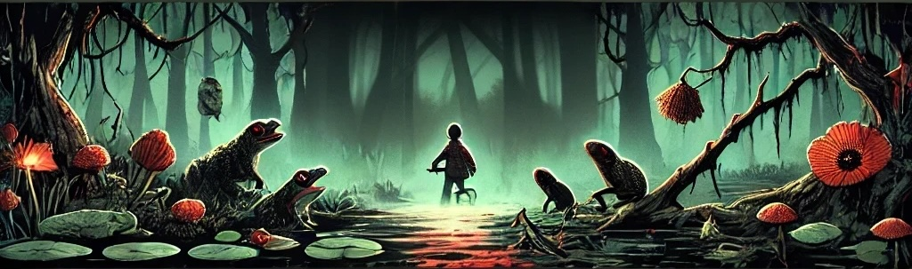

*Turning swamps upside down, one frog at a time.*

---

## About the Project

**swampUPsideDOWN** is a revolutionary initiative that aims to redefine swamp ecosystems by flipping them upside down—literally! Inspired by a passion for innovative solutions and a touch of whimsy, this project is as quirky as it is groundbreaking.

Meet **Arnold Pollard**, a senior developer at **ToadallyNotAmphibians Inc.**, a company that's *ribbit*-ed itself of any frog affiliations. After a fateful encounter where a frog stole his sandwich during a lunch break, Arnold vowed to create a world where frogs no longer leap uninvited.

> "*They said the swamp couldn't be drained. I said, let's flip it instead!*"  
> — Arnold Pollard

Fueled by his company's (totally not obsessive) disdain for frogs, Arnold embarked on a mission to upend swamp ecosystems. Thus, **swampUPsideDOWN** was born—a project that doesn't just think outside the box; it flips the box and shakes out all the frogs!

## Features 🌟

- **Frog Inversion Algorithm (FIA):** Recalculates swamp terrains to be inhospitable to frogs.
- **Amphibian Detection Radar (ADR):** Scans and detects any lingering amphibian presence.
- **Swamp Flipping Mechanics:** Because why drain the swamp when you can flip it?

## Contributing 🤝

Contributions are what make the open-source community such an amazing place. Any contributions you make are **greatly appreciated**. Just remember:

- **Fork this repo, and open a Pull Request, we will make sure to run our anti-frog linters and automations on it before we approve them.**

- **No frogs allowed** in code comments or variable names.

## License 📄

- Distributed under the MIT License. See `LICENSE` for more information.
- And again, cannot be used by frogs in any way or form.

## Contact 📬

Arnold Pollard - https://www.linkedin.com/in/arnold-pollard

---

*Disclaimer: No frogs were harmed in the making of this project. They were just... flipped.*
